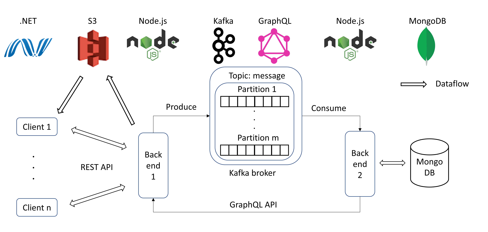

# TrojanChat
This repo contains Web-based simple frontend and backend for TrojanChat Application, which is the final project of EE547 at USC.

## Overall Architecture

- Frontends: One Windows Application built with WPF using .NET6 (Not in this repo), one Web Application built with HTML, CSS, Boostrap, and AJAX.
- Backends: Both backend 1 and backend 2 are built with NodeJS using express.
- RESTful API: Interaction between Frontend and Backend 1.
- GraphQL API: Interaction between Backend 1 and Backend 2.
- Kafka Pipeline: Backend 1 as Topic Producer; Backend 2 as Topic Consumer.
- MongoDB: Text messages and User information storage.
- AWS S3: Image and Video storage.
- AWS ECS: Project deployment (backends and web-frontend).



## Run On AWS

**Cloud Prerequisite**

- A Standard S3 bucket will suffice for storage.
- A single t2.small EC2 server (Linux, x86 64-bit, 1 vCPU, and 2 GiB Memory), which is not in free-tier and costs 0.023 USD per Hour for the time I do.

Note: 1 GiB memory does not suffice, because bitnami/zookeeper:latest needs more than 1 GiB.

**Env. Prerequisite**

Once you get this repo to AWS already, you may need to:

- Install Docker
```
sudo yum update -y
# install docker
sudo amazon-linux-extras install docker
# launch service
sudo service docker start
# grant permission to user
sudo usermod -a -G docker ec2-user
```

- Install Docker Compose
```
# install latest version
sudo curl -L https://github.com/docker/compose/releases/latest/download/docker-compose-$(uname -s)-$(uname -m) -o /usr/local/bin/docker-compose
# grant permission to docker-compose
sudo chmod +x /usr/local/bin/docker-compose
```

**Change Codes**

- Web Frontend

For both `frontend -> index.html` and `frontend -> chat_app.html`:

Change the line of `const serverIP = '54.187.66.112';` to the IP of the server you are using.

- AWS S3

For `producer -> .env`:

Change these fields: AWS_BUCKET_NAME, AWS_BUCKET_REGION, AWS_ARN, AWS_ACCESS_KEY, AWS_SECRET_KEY.

Where the AWS_ACCESS_KEY and AWS_SECRET_KEY are the key of the user you created for accessing AWS S3.


**Launch Project**

Go to the root of project, where docker-compose.yml exists.

- Launch Docker Containers

```
docker-compose up -d
```

- Install Packages

```
# enter backend1
docker exec -it backend1 bash
# install packages
npm i
```

- Launch producer/backend1

```
npm run start:producer
# or
node producer/index.js
```

- Enter and Launch consumer/backend2

```
npm run start:consumer
# or
node consumer/index.js
```

You are ready to go now!

## Access via Web

Go to browser: http://ip_of_your_server:3000/

If this cannot access, you may need to open the port for your server.

AWS -> EC2 -> Network & Security -> Security Groups

Choose the one that your server are using, then give it Custom TCP with port 3000 (Source could be either 0.0.0.0/0 or specific to your local IP).

## Run Locally

For running locally, AWS S3 are still needs to be setup as mentioned above. But the IP in frontend files could be just `localhost`.

If on Windows, could use Docker Desktop for launching containers.

## Files Description

- Directories

`consumer`: Consumer code (Backend 2), including GraphQL API implementaion, Kafka Consumer, MongoDB Client.<br>
`demo`: Images for demonstration.<br>
`frontend`: Web-based Frontend code.<br>
`producer`: Producer code (Backend 1), including RESFful API implementation, AWS S3 client, Kafka Producer, GraphQL client.<br>
`requests`: VScode RESTful API debugging tool.

- Files

`dirname.js`: Helper file for get current path location.<br>
`docker-compose.yml`: Docker-Compose file for launching containers, including zookeeper, Kafka, Backend 1, Backend 2, and MongoDB.<br>
`graphql.txt`: A record of a few GraphQL requests used for debugging when developing.<br>
`messageType.js`: The message format definition for streaming through Kafka Pipeline.<br>
`package.json`: Packages Dependencies.
